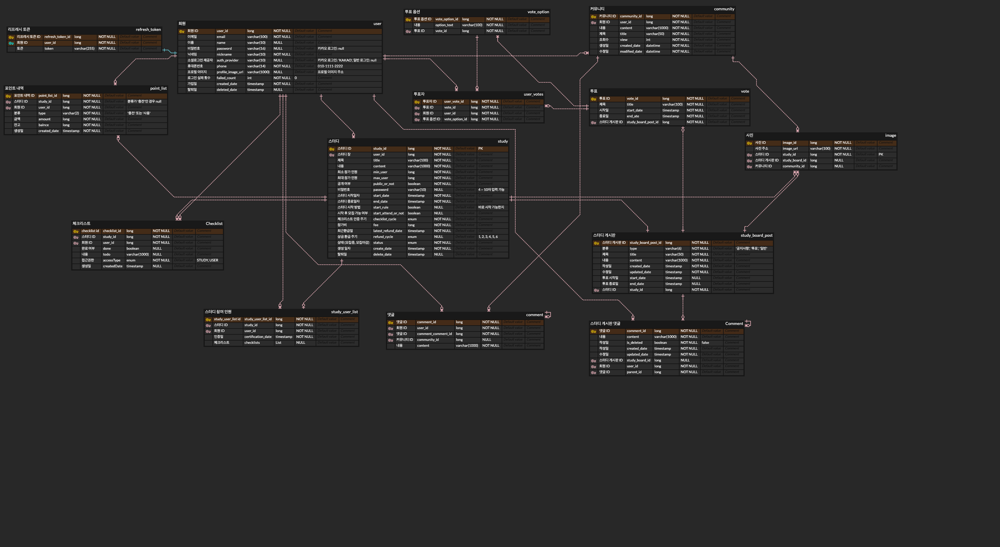
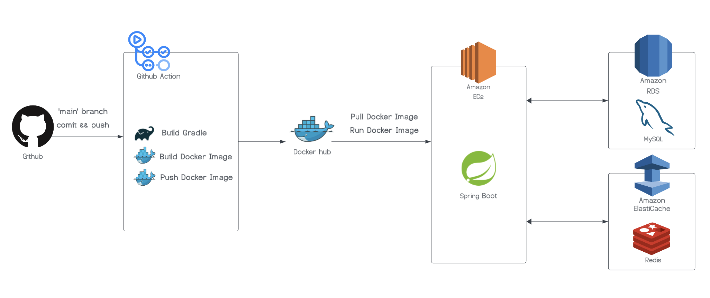

# 문방구 프로젝트

## 서비스 설명

이용자들이 보다 효과적으로 학습할 수 있도록 지원하는 서비스입니다. 스터디 그룹 참여, 체크리스트 공유 및 인증 확인 기능을 제공하여 사용자가 공부에 대한 동기를 높일 수 있도록 돕습니다. 같은 목표를 가진 스터디원들과 함께 학습함으로써, 공부 효율을 극대화할 수 있습니다.

- 개발 기간: 2023.10 ~ 2023.11
- 개발 인원: 백엔드 4명
- 기술스택
    - **언어** `Java11 - Oracle Open JDK 11.0.18`
    - **프레임워크** `Spring Boot 2.7.17`
    - **데이터베이스** `MySQL 8.0.33` `Redis` `H2` `RDS`
    - **환경** `GithubActions` `Docker` `EC2`
    - **협업 도구** `Github` `Notion` `Slack` `Discord`
      
<!-- ### 🔗 [Swagger API 문서](http://43.203.21.168:8080/swagger-ui/#/)-->

## 팀원

<table align="center">
  <tr>
   <th >
    나지은
   </th>
   <th>
    박준표
   </th>
   <th >
    이윤빈
   </th>
   <th >
    조하나
   </th>
   </tr>
  <tr>
    <td align="center">
         
         
    </td>
    <td align="center">
         
         
    </td>
    <td align="center">
         
         
    </td>
    <td align="center">
         
         
    </td>
  </tr>
</table>

## ERD

## 시스템 아키텍처

## 프로젝트 요구 사항

### 회원
- 회원가입은 일반 회원가입과 소셜 로그인을 통한 회원가입이 있다.
- 일반 회원으로 가입하려면 회원 아이디(이메일), 비밀번호, 닉네임, 휴대폰 번호를 입력해야 한다.
- 비밀번호와 휴대폰 번호는 암호화하여 저장한다.
- 소셜 로그인을 통한 회원가입을 하려면 닉네임, 휴대폰번호를 입력해야 한다.
- 회원은 회원 아이디(이메일)로 식별한다.
- 휴대폰 번호 인증은 SMS를 통해서 진행된다.
- 일반 회원가입 시 이메일 인증이 필요하며, 이메일 인증 메일 발송 후 5분 내에 인증번호를 입력해야 한다.
- 회원가입 시 닉네임 중복 여부 확인이 필요하다.
- 2~10자의 닉네임을 생성할 수 있으며, 한글, 영문, 숫자를 사용할 수 있습니다.
- 로그인은 일반 로그인과 소셜 로그인이 있다.
- 아이디를 찾기 위해서는 휴대폰 번호 인증이 필요하다.
- 일반 회원가입을 한 경우, 비밀번호 변경을 위해서는 이메일 정보와 휴대폰 번호 인증이 필요하다.
- 일반 로그인 시, 비밀번호를 5회 틀리면 해당 계정은 잠기게 된다.
- 잠긴 계정을 풀기 위해서는 비밀번호 변경 작업이 필요하다.
- Access Token의 유효시간은 48시간으로 하고, Refresh Token의 유효시간은 한 달로 한다.
- 로그아웃 시 Access Token과 Refresh Token이 만료된다.
- 회원정보 조회 시 회원 아이디(이메일), 닉네임, 휴대폰 번호, 프로필 사진, 스터디 참여 이력(스터디명, 분야, 참여자 수, 스터디 시작일, 스터디 종료일) 정보를 반환한다.
- 회원은 닉네임, 프로필 이미지를 수정할 수 있다.
- 프로필 이미지의 확장자는 .jpeg, .jpg, .png로 제한한다.

## 스터디
- 회원은 스터디를 생성할 수 있고, 한 명의 회원은 여러 스터디를 생성할 수 있다.
- 스터디를 생성하려면 스터디명, 스터디 소개, 최소 참여 인원, 최대 참여 가능 인원, 공개 여부, 스터디 시작 일자, 스터디 종료 일자(선택), 스터디 시작 방법, 스터디에서 진행될 체크리스트, 스터디 시작 후 추가 스터디원 모집 가능 여부, 체크리스트 인증 주기**, 참가비 여부, 참가비, 상금 환급 주기를** 입력해야 한다.
- 인증 주기는 평일 매일, 주말 매일, 월-토 매일, 주 1일, 주 2일, 주 3일 중 하나를 선택한다.
- 스터디 소개에는 이미지 첨부가 가능하다.
- 스터디를 생성한 사람은 스터디 장이 된다.
- 스터디는 스터디 고유 번호로 식별한다.
- 공개 스터디는 인원이 허용하는 한 모든 회원이 참여 가능하다.
- 비공개 스터디 참여를 위해서는 비밀번호가 필요하다.
- 비공개 스터디 비밀번호는 스터디를 생성할 때 입력한다.
- 비밀번호 변경은 스터디 장만 가능하다.
- 회원은 스터디에 참여할 수 있고, 한 명의 회원은 여러 스터디를 참여할 수 있다.
- 회원은 스터디에 참여할 때 개인의 체크리스트를 추가할 수 있다.
- 회원은 본인이 참여하는 스터디 스터디원의 체크리스트를 조회할 수 있다.
- 스터디가 생성되면 해당 스터디를 위한 게시판과 자료실이 생성된다.
- 게시판에서 공지사항과 투표글, 일반 게시글을 올릴 수 있다.
- 게시판에서 스터디 관련된 투표를 진행할 수 있다.
- 스터디 삭제나 스터디원 강퇴 시 스터디원이 있다면 모든 스터디원의 동의가 필요하다.
- 스터디 삭제 시 스터디원이 없다면 스터디장에 의해 바로 삭제가 가능하다.
- 스터디명, 최대 참여 가능 인원, 공개 여부는 수정 가능하다.
- 스터디 참여자는 스터디 전체 참여도와 스터디원 개별 참여도 정보를 확인할 수 있다.
- 참여도는 체크리스트 인증 여부로 결정한다.
- 매일 인증하는 스터디는 1일 단위로 참여도를 갱신하며, 주 단위로 인증하는 스터디는 1주 단위로 참여도를 갱신한다
- 체크리스트는 사진을 업로드해서 달성 여부를 확인한다.
- 각각의 체크리스트에 맞는 사진을 업로드해야 한다.
- 스터디는 스터디명, 공개여부로 검색 가능하다.
- 스터디 상세 조회 시 스터디명, 최대 참여 가능 인원,  공개 여부, 스터디 상세 설명, 스터디 참여중인 회원 정보를 반환한다.
- 관리자는 모든 스터디를 삭제할 수 있다.
- 스터디는 스터디원 모집에 따라 모집중/모집마감으로 분류할 수 있다.
- 스터디 참여인원이 최대 모집인원과 같아지면 모집상태를 “모집 마감”으로 변경한다
- 스터디는 스터디 진행에 따라 시작 전/진행중/ 종료스터디로 분류할 수 있다.
- 스터디 시작 방법에는 최소 인원이 참여하여 시작하는 방법과 설정한 시작 일자에 시작하는 방법이 있다.
- 스터디는 스터디가 시작 되면, 스터디 상태를 “진행중”로 변경한다
- 스터디장은 스터디 종료일을 당일 혹은 특정 날짜로 설정할 수 있다.
- 스터디는 스터디 종료일자가 되면, 스터디 상태를 “종료스터디”로 변경한다
- 하나의 스터디에는 하나의 스터디 게시판이 생성된다.
- 스터디 게시판은 해당 스터디원만 이용가능하다.
- 스터디 게시판 게시글의 카테고리는 `공지사항`, `일반`, `투표`이다.
- 스터디원은 댓글과 대댓글을 남길 수 있다.
- 본인이 작성한 게시글, 댓글, 대댓글만 수정 및 삭제가 가능하다.

### 커뮤니티 
- 커뮤니티의 카테고리는 일상, 질문이 있다.
- 회원은 커뮤니티에 여러 게시물을 작성할 수 있다.
- 회원은 게시글에 댓글과 대댓글을 남길 수 있다.
- 회원은 본인이 작성한 게시글, 댓글, 대댓글만 수정, 삭제가 가능하다.
- 커뮤니티 게시글의 필수 사항은 제목, 내용이 있고 선택사항은 사진 첨부가 있다.
- 커뮤니티 게시글은 해시태그로 검색이 가능하다.

## API 명세
### 로그인/회원가입

|Domain|URL|HTTP Method|Description|
|---|---|---|---|
|Auth|/login|POST|로그인|
||/api/auth/logout|POST|로그아웃|
||/api/login/{auth_provider}|POST|소셜로그인|
||/api/auth/verify-phone|POST|문자 인증 확인|
||/api/auth/verify-email|POST|이메일 인증 확인|
||/api/auth/sign-up|POST|회원가입|
||/api/auth/find-id|POST|아이디 찾기|
||/api/auth/find-pw/{user_id}|POST|비밀번호 찾기|
||/api/auth/find-pw/{user_id}/confirm|POST|비밀번호 재설정|
|User|/api/user/{user_id}|GET|회원정보 열람|
||/api/user/{user_id}|PATCH|회원정보 수정
||/api/user/{user_id}/profile|POST|프로필 사진 업로드|
|Study|/api/study|POST|스터디 개설|
||/api/study/{study_id}|PATCH|스터디 수정|
||/api/study/{study_id}|DELETE|스터디 삭제|
||/api/study?keyword={keyword}|GET|스터디 조회|
||/api/study/{study_id}|GET|스터디 상세 조회|
||/api/user/{user_id}/study/{study_id}|POST|스터디 신청|
||/api/user/{user_id}/study/{study_id}|DELETE|스터디 탈퇴|
||/api/study/{study_id}/participation|GET|스터디 참여도 조회|
||/api/study/{study_id}/participation/{user_id}|GET|스터디원 참여도 조회|
||/api/study/{study_id}/mission|POST|스터디 공통 체크리스트 등록|
||/api/study/{study_id}/mission/{mission_id}|PATCH|스터디 공통 체크리스트 수정|
||/api/study/{study_id}/mission/{mission_id}|DELETE|스터디 공통 체크리스트 삭제|
||/api/study/user/{user_id}/study/{study_id}/mission|POST|스터디원 개별 체크리스트 등록|
||/api/study/{study_id}/user/{user_id}/mission/{mission_id}|PATCH|스터디원 체크리스트 상태 변경|
||/api/study/user/{user_id}/mission|GET|개인 체크리스트 조회|
||/api/study/{study_id}/mission|GET|스터디 체크리스트 조회|
|Study Board|/api/study/{study_id}/post|POST|게시글 작성|
||/api/study/{study_id}/post/{post_id}|PATCH|게시글 수정|
||/api/study/{study_id}/post/{post_id}|DELETE|게시글 삭제|
||/api/study/{study_id}/poll/{poll_id}|POST|투표|
||/api/study/{study_id}/post-commnet/{post_id}/|POST|댓글 작성|
||/api/study/{study_id}/post-commnet/{post_id}/{comment_id}|PATCH|댓글 수정|
||/api/study/{study_id}/post-commnet/{post_id}/{comment_id}|DELETE|댓글 삭제|
||/api/study/{study_id}/post-comment/{post_id}/{comment_id}/comment|POST|대댓글 작성|
||/api/study/{study_id}/post-comment/{post_id}/{comment_id}/comment/{comment_id}|PATCH|대댓글 수정|
||/api/study/{study_id}/post-comment/{post_id}/{comment_id}/comment/{comment_id}|DELETE|대댓글 삭제|
|Community|/api/community/post|POST|게시글 작성|
||/api/community/post/{id}|PATCH|게시글 수정|
||/api/community/post/{id}|DELETE|게시글 삭제|
||api/community/search/?title={title}&content={content}|GET|게시글 검색|
||/api/community/comments/{communityId}|POST|댓글 작성|
||/api/community/comments/{commentId}|PATCH|댓글 수정|
||/api/community/comments/{commentId}|DELETE|댓글 삭제|
||/api/community/comments/{communityId}/replies|POST|대댓글 작성|
||/api/community/comments/replies/{replyId}|PATCH|대댓글 수정|
||/api/community/comments/replies/{replyId}|DELETE|대댓글 삭제|

## 프로젝트 기여 부분
**✅ 소셜 로그인 구현**
- Spring Security, oAuth2.0을 이용하여 카카오 로그인 구현

**✅ Token Provider 유틸 생성**
- 사용자 인증 및 권한 부여를 위해 JWT를 활용한 토큰 생성과 관리 구현

**✅ 스터디 게시판 구현**
- 요청 시 보내는 Access Token에서 회원 정보를 추출하여 해당 스터디원인지 판별
- 해당 스터디원만 이용 가능한 게시판 구현

**✅ CI/CD 구축**
- Github Actions, Docker, EC2, RDS 를 이용하여 배포

  

